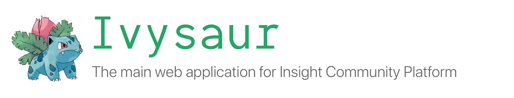

# Outsight Webapp

## Setting up
1. `cd outsight-webapp`
2. `npm install`
3. Add a `.env` file
4. Add `NODE_PATH = src` to `.env` file
5. `npm run start`

## Release History

* 5.3.2:
    - Skill bank enhancements + fix:
        - [Skill Bank] BUG - User will not be added to channel after they re-add a skill https://insightdatapm.atlassian.net/browse/OUT-3027
        - [Skill Bank] Enhance - Mention experts after user redirected to the channel https://insightdatapm.atlassian.net/browse/OUT-3030
        - [Skill Bank] Enhance - Order skill list by alphabet https://insightdatapm.atlassian.net/browse/OUT-3028
        - [Skill Bank] Enhance - Remind user will be added to channel after they add skill https://insightdatapm.atlassian.net/browse/OUT-3029

* 5.3.1:
    - Hotfix: thread detail scrolling

* 5.3.0:
    - Skill bank: https://insightdatapm.atlassian.net/browse/OUT-2956
    - User edit profile: https://insightdatapm.atlassian.net/browse/OUT-2944
    - Linkedin profile usage clarification: https://insightdatapm.atlassian.net/browse/OUT-2943
    - Updated logic regarding default channels: https://insightdatapm.atlassian.net/browse/OUT-2982
    - Tag suggestion popup is cut off in Thread view: https://insightdatapm.atlassian.net/browse/OUT-2935
    - HTML formatting issues in FAQ page: https://insightdatapm.atlassian.net/browse/OUT-2946
    - HTML formatting in asking permission: https://insightdatapm.atlassian.net/browse/OUT-2947
    - DMG reconnect https://insightdatapm.atlassian.net/browse/OUT-2965

* 5.2.16:
    - Allow user to set a custom status message
    - https://insightdatapm.atlassian.net/browse/OUT-2930
    - https://insightdatapm.atlassian.net/browse/OUT-2931
    - Fix: list channel can't load more https://insightdatapm.atlassian.net/browse/OUT-2941
    - Enhancement: add send message button to user profile https://insightdatapm.atlassian.net/browse/OUT-2929
    - Enhancement: more user-friendly error message https://insightdatapm.atlassian.net/browse/OUT-2854

* 5.2.15:
    - Fix: The UX when user edit channel / gc name is not clear https://insightdatapm.atlassian.net/browse/OUT-2467
    - Fix: The UX for editing topic is not user friendly https://insightdatapm.atlassian.net/browse/OUT-2466
    - Feature: Search enhancement - Search message in all channel/conversation https://insightdatapm.atlassian.net/browse/OUT-2868
    - Feature: Handle share link cases in messaging https://insightdatapm.atlassian.net/browse/OUT-2899
    - Feature: Integrate the invitation system into onboarding https://insightdatapm.atlassian.net/browse/OUT-2891

* 5.2.14:
    - Fix: image rotation on upload https://insightdatapm.atlassian.net/browse/OUT-1855
    - Fix: `@channel` mention vs `@here` mention https://insightdatapm.atlassian.net/browse/OUT-2824
    - Add: filter by member in searching for messages https://insightdatapm.atlassian.net/browse/OUT-2869
    - Fix: edit topic in DMs https://insightdatapm.atlassian.net/browse/OUT-2874

* 5.2.13:
    - Thread routing: https://insightdatapm.atlassian.net/browse/OUT-1562
    - DM name for removed users: https://insightdatapm.atlassian.net/browse/OUT-2806
    - Fix: messages incorrectly displayed as edited https://insightdatapm.atlassian.net/browse/OUT-1223
    - Fix: slow down after being inactive https://insightdatapm.atlassian.net/browse/OUT-2757
    - Fix: deleting a channel crashes the page https://insightdatapm.atlassian.net/browse/OUT-2860

* 5.2.12:
    - Fix search bar copywriting

* 5.2.11:
    - Fix reconnect
        - https://insightdatapm.atlassian.net/browse/OUT-2666
        - https://insightdatapm.atlassian.net/browse/OUT-2745
        - https://insightdatapm.atlassian.net/browse/OUT-2746
        - https://insightdatapm.atlassian.net/browse/OUT-2778
        - https://insightdatapm.atlassian.net/browse/OUT-2779
        - https://insightdatapm.atlassian.net/browse/OUT-2825
    - Search channels/conversation (https://insightdatapm.atlassian.net/browse/OUT-1315)
    - Fix thread in-app notification (https://insightdatapm.atlassian.net/browse/OUT-2809)

* 5.2.10:
    - Unread messages highlight (https://insightdatapm.atlassian.net/browse/OUT-2705)
    - Notification permission prompt no longer shown before logged in (https://insightdatapm.atlassian.net/browse/OUT-2798)
    - Fixed incorrect default channel after switching team (https://insightdatapm.atlassian.net/browse/OUT-2800)

* 5.2.9:
    - Add: Save messages (https://insightdatapm.atlassian.net/browse/OUT-2629)

* 5.2.8:
    - Hotfix: In-app notification

* 5.2.7:
    - Add: archive channels (https://insightdatapm.atlassian.net/browse/OUT-1694)
    - Fix: message list scroll position when visiting a channel (https://insightdatapm.atlassian.net/browse/OUT-2684, https://insightdatapm.atlassian.net/browse/OUT-2653, https://insightdatapm.atlassian.net/browse/OUT-2708)
    - Fix: '@' in email trigger mentions (https://insightdatapm.atlassian.net/browse/OUT-2728)
    - https://insightdatapm.atlassian.net/browse/OUT-2653
    - Update: Markdown copy https://insightdatapm.atlassian.net/browse/OUT-2749

* 5.2.2:
    - Improve: search
    - Fix: push_notifications

* 5.2.1:
    - Improve: search
    - Feature: Inteview tracking

* 5.2.0:
    - Add: search messages MVP

* 5.1.5:
    - Bug fixes: &nbsp characters in newsfeed and other UI components
    - Bug fixes: cannot edit message with mentions

* 5.1.4:
    - Bug fixes
    - Add: session badge

* 5.1.3:
    - Add: Full Emoji support for reaction
    - Add: badge indicating fellow's sessions in various places
    - Improve: reconnect handling after idle
    - Add: Image download
    - Fix: next/prev navigation for messages with multiple images
    - Fix: disable deleting of default channels
    - Add: login tracking + potential fix for frequently logout

* 5.1.2:
    - Fix: FAQ link and Roadmap
    - Fix: DMG flashes on reconnect
    - Fix: channel scrolling when there are images
    - Fix: mention data is cached when switching between conversations
    - Add: team reordering

* 5.1.1:
    - Fix: Emoji loading
    - Fix: unread when in the middle of chat history
    - Fix: DMGs routing
    - Enhancement: thread red-dot
    - Enhancement: faster read feedback
    - Enhancement: faster reaction feedback

* 5.1.0:
    - Rearchitecture
    - Feature: Reaction

* 5.0.0:
    - Rearchitecture (beta)
    - Feature: 20B onboarding
    - Feature: aggreement signing

* 4.7.7:
    - Features: Reload window on disconnect/reconnect (limited to Platform Dev team only)
    - Features: Reload window after 15min of inactivity (limited to Platform Dev team only)
    - Features: interview section
    - Fix: Cannot load thread history
    - Fix: Image upload
    - Fix: Gifs not loading

* 4.7.6:
    - Feature: teams are now ordered by creation time
    - Fix: issue prevent new users to login

* 4.7.5:
    - Feature: warn users when @channel on channel with a lot of members
    - Fix: messaging spacing issue from release 4.7.4
    - Fix: change channel public/private to radio button for clarity

* 4.7.3, 4.7.4:
    - Feature: [Messaging] Show user avatar when adding member to group conversations
    - Feature: [Messaging] Menu to allow create new chat / view user profile
      when clicking user avatar / name

* 4.7.2:
    - Feature: [Messaging] See notification badge on team icon when receive new thread reply
    - Feature: [Messaging] See notification icon on browser tab when have notifications
    - [Messaging] Consolidate to Amplify/Cognito for web app authentication
    - Fix bug : [Messaging] User sometimes can't click and view channel information
    - Fix bug: [Messaging] When the chat box expands, the send button is hidden
    - Fix bug: [Resources] The "topic" filter in resources doesn't return any result

* 4.7.1
    - Add: support for hiding programs from recommendations

* 4.7.0
    - Add: channel favorite

* 4.6.2:
    - Update: welcome screen copywriting

* 4.6.0:
    - Add: settings for Messaging email notifications
    - Fix: padding for images on messages
    - Fix: markdown (URL, mixed numbered lists, iframe XSS, detect links)

* 4.5.2
    - Fix for channel mixup
    - Fix for thread mixup
    - Temporary hiding LinkedIn information while reviewing privacy policy.

* 4.5.1:
    - Add: bubbling up direct-message/group-chat conversations under Unreads section

* 4.3.9:
    - Fix: bugs that redirect users who hasn't completed Cognito account setup to login

* 4.3.8:
    - Fix: handle `Auth.currentSession()` throw 'No current user' when getting Cognito token

* 4.3.7:
    - Add: logic to deactivate and reactivate browser tokens on login/logout
    - Add: Unread channels UI
    - Fix: GIF display, image display

* 4.3.6:
    - Add: A banner to warn staff users about the possibility for conversations on platform to be replaced by the ones migrated from Mattermost

* 4.3.5:
    - Add: FAQ and road map button to messaging

* 4.3.4:
    - Update: channel creation UI
    - Update: copywriting for session selection form

* 4.3.2:
    - Fix: Crash on converastions that do not have last message

* 4.3.1:
    - Fix: Crash on loading last message of conversation that has channel mention

* 4.3.0:
    - Update: Message protocol
    - Add: Channel detail information edit
    - Add: Web push notification

* 4.2.6:
    - Add: 500 - Server Error handling

* 4.2.5:
    - Adjust session filter to comply with new Elasticsearch convention

* 4.2.3:
    - Add edit message feature

* 4.2.2:
    - Fix delete message causes problems with threading
    - Update recommendation copywriting

* 4.2.1:
    - Improve real-time messaging issue

* 4.2.0:
    - Fix real-time messaging issue
    - Enable messaging tab on mobile

* 4.1.3:
    - Update Spotlight UI

* 4.1.2:
    - Change CHAT to MESSAGING
    - Remove footer

* 4.1.1:
    - Fix: missed trailing slash for message read API

* 4.1.0:
    - Add messaging
    - Feature toggle for chat

* 4.0.0:
    - Event: Add amplitude events
    - Spotlight: Add Spotlight CRUD forms (but not yet visible)

* 3.9.5:
    - Event: Fix typos in event preview and printing page

* 3.9.4:
    - Event: Add event preview and printing

* 3.9.3:
    - Event: Fix: Some event cover image isn't displayed in event detail page.
    - GIPHY: Update production key
    - Image upload: Fix: some images cannot be resized

* 3.9.2:
    - Event: Fix: Allow guests to be invited to events.
    - Event: Update: Restrict event visibility by session and user group.
    - Newsfeed: Edit comment
    - Newsfeed: Add GIF to comments
    - Newsfeed: update: maximum allowed image size is 5MB

* 3.9.1:
    - Event: fix cannot invite guest for unlimited-space events

* 3.9: (Restart versioning)
    - Newsfeed: Upload images
    - Newsfeed: _See more_ and _See less_ for post with long content
    - Newsfeed: Upload GIF
    - Newsfeed: Add label to indicate if a post was _Edited_
    - Newsfeed: Mention other users on posts and comments
    - Newsfeed: Email notification for post comment activity.
    - Recommendation: Alumni recommendation
    - Profile: show list of projects directly on the profile page
